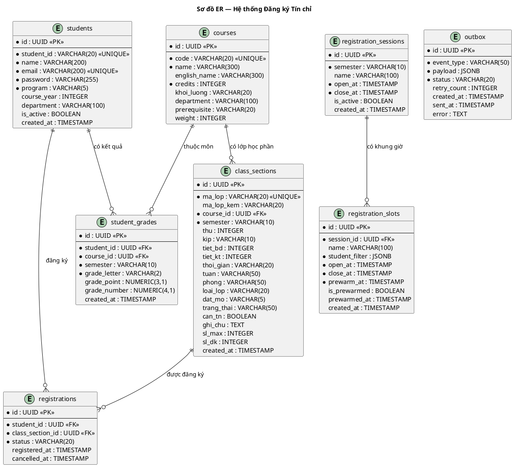

# Thiết kế Cơ sở dữ liệu

---

## 1. Sơ đồ ER (Entity Relationship Diagram)

> Paste vào https://www.plantuml.com/plantuml/uml/ để xem.



---

## 2. Mô tả chi tiết các bảng

### 2.1 Bảng `students` — Sinh viên

| Cột | Kiểu | Ràng buộc | Mô tả |
|---|---|---|---|
| `id` | UUID | PK, DEFAULT gen_random_uuid() | Khóa chính |
| `student_id` | VARCHAR(20) | UNIQUE, NOT NULL | Mã số sinh viên (VD: 20215678) |
| `name` | VARCHAR(200) | NOT NULL | Họ tên |
| `email` | VARCHAR(200) | UNIQUE, NOT NULL | Email |
| `password` | VARCHAR(255) | NOT NULL | Mật khẩu đã hash (bcrypt) |
| `program` | VARCHAR(5) | NOT NULL | Chương trình: A / B / AB |
| `course_year` | INTEGER | | Năm nhập học (VD: 2021 → K66) |
| `department` | VARCHAR(100) | | Viện/Khoa |
| `is_active` | BOOLEAN | DEFAULT TRUE | Tài khoản còn hoạt động |
| `created_at` | TIMESTAMP | DEFAULT NOW() | Thời điểm tạo |

**Ghi chú:** `program` và `course_year` dùng để lọc sinh viên thuộc nhóm đăng ký nào khi hệ thống tạo `allowed:{slot_id}` trong Redis.

---

### 2.2 Bảng `courses` — Môn học

| Cột | Kiểu | Ràng buộc | Mô tả |
|---|---|---|---|
| `id` | UUID | PK | Khóa chính |
| `code` | VARCHAR(20) | UNIQUE, NOT NULL | Mã học phần (VD: AC2070) |
| `name` | VARCHAR(300) | NOT NULL | Tên môn học |
| `english_name` | VARCHAR(300) | | Tên tiếng Anh |
| `credits` | INTEGER | NOT NULL | Số tín chỉ |
| `khoi_luong` | VARCHAR(20) | | Khối lượng (VD: 3(2-1-1-6)) |
| `department` | VARCHAR(100) | | Viện/Khoa quản lý |
| `prerequisite` | VARCHAR(20) | | Mã môn tiên quyết |
| `weight` | INTEGER | DEFAULT 1 | Hệ số ưu tiên |

---

### 2.3 Bảng `class_sections` — Lớp học phần

| Cột | Kiểu | Ràng buộc | Mô tả |
|---|---|---|---|
| `id` | UUID | PK | Khóa chính |
| `ma_lop` | VARCHAR(20) | UNIQUE, NOT NULL | Mã lớp (VD: 169995) |
| `ma_lop_kem` | VARCHAR(20) | | Mã lớp lý thuyết đi kèm |
| `course_id` | UUID | FK → courses | Môn học |
| `semester` | VARCHAR(10) | NOT NULL | Học kỳ (VD: 20252) |
| `thu` | INTEGER | | Thứ trong tuần (2–7) |
| `kip` | VARCHAR(10) | | Kíp học: Sáng / Chiều / Tối |
| `tiet_bd` | INTEGER | | Tiết bắt đầu (1–6) |
| `tiet_kt` | INTEGER | | Tiết kết thúc (1–6) |
| `thoi_gian` | VARCHAR(20) | | Giờ học raw (VD: 0645-0910) |
| `tuan` | VARCHAR(50) | | Tuần học (VD: 25-32,34-42) |
| `phong` | VARCHAR(50) | | Phòng học |
| `loai_lop` | VARCHAR(20) | | LT+BT / TN / ĐA / TT ... |
| `dat_mo` | VARCHAR(5) | | Đợt mở: A / B / AB |
| `trang_thai` | VARCHAR(50) | | Điều chỉnh ĐK / Hủy lớp ... |
| `can_tn` | BOOLEAN | DEFAULT FALSE | Bắt buộc đăng ký kèm lớp TN |
| `ghi_chu` | TEXT | | Ghi chú |
| `sl_max` | INTEGER | DEFAULT 0 | Sĩ số tối đa |
| `sl_dk` | INTEGER | DEFAULT 0 | Số đã đăng ký |
| `created_at` | TIMESTAMP | DEFAULT NOW() | Thời điểm tạo |

**Ghi chú về `loai_lop`:**

| Giá trị | Ý nghĩa |
|---|---|
| `LT+BT` | Lý thuyết + Bài tập (lớp chính) |
| `TN` | Thí nghiệm / Thực hành |
| `ĐA` | Đồ án |
| `TT` | Thực tập |

**Ghi chú về lớp kèm:**
- Lớp `TN` có `ma_lop_kem` trỏ đến lớp `LT+BT` tương ứng
- Lớp `LT+BT` có `can_tn = TRUE` → bắt buộc đăng ký kèm 1 lớp `TN` cùng môn

---

### 2.4 Bảng `registrations` — Đăng ký học phần

| Cột | Kiểu | Ràng buộc | Mô tả |
|---|---|---|---|
| `id` | UUID | PK | Khóa chính |
| `student_id` | UUID | FK → students, NOT NULL | Sinh viên |
| `class_section_id` | UUID | FK → class_sections, NOT NULL | Lớp học phần |
| `status` | VARCHAR(20) | DEFAULT 'ACTIVE' | ACTIVE / CANCELLED / PENDING |
| `registered_at` | TIMESTAMP | DEFAULT NOW() | Thời điểm đăng ký |
| `cancelled_at` | TIMESTAMP | | Thời điểm hủy |

**Ràng buộc:** `UNIQUE(student_id, class_section_id)` — mỗi SV chỉ đăng ký 1 lần cho mỗi lớp.

---

### 2.5 Bảng `student_grades` — Kết quả học tập

| Cột | Kiểu | Ràng buộc | Mô tả |
|---|---|---|---|
| `id` | UUID | PK | Khóa chính |
| `student_id` | UUID | FK → students | Sinh viên |
| `course_id` | UUID | FK → courses | Môn học |
| `semester` | VARCHAR(10) | NOT NULL | Học kỳ |
| `grade_letter` | VARCHAR(2) | NOT NULL | Điểm chữ: A / B+ / B / C+ / C / D+ / D / F |
| `grade_point` | NUMERIC(3,1) | | Điểm thang 4 |
| `grade_number` | NUMERIC(4,1) | | Điểm số 0–10 |
| `created_at` | TIMESTAMP | DEFAULT NOW() | Thời điểm tạo |

**Ghi chú:** Lưu dạng snapshot — học lại nhiều lần = nhiều bản ghi. Validate tiên quyết chỉ cần tồn tại ít nhất 1 bản ghi có `grade_letter != 'F'`.

**Ràng buộc:** `UNIQUE(student_id, course_id, semester)`

---

### 2.6 Bảng `outbox` — Hàng đợi gửi email

| Cột | Kiểu | Ràng buộc | Mô tả |
|---|---|---|---|
| `id` | UUID | PK | Khóa chính |
| `event_type` | VARCHAR(50) | NOT NULL | REGISTRATION_SUCCESS / REGISTRATION_FAILED / REGISTRATION_CANCELLED |
| `payload` | JSONB | NOT NULL | `{ studentId, studentEmail, studentName, courseName, maLop, semester }` |
| `status` | VARCHAR(20) | DEFAULT 'PENDING' | PENDING / SENT / FAILED |
| `retry_count` | INTEGER | DEFAULT 0 | Số lần thử lại |
| `created_at` | TIMESTAMP | DEFAULT NOW() | Thời điểm tạo |
| `sent_at` | TIMESTAMP | | Thời điểm gửi thành công |
| `error` | TEXT | | Thông tin lỗi nếu thất bại |

**Ghi chú:** Outbox được INSERT trong cùng transaction với đăng ký → đảm bảo atomic: đăng ký thành công thì chắc chắn có email, không bao giờ gửi email khi đăng ký thất bại.

---

### 2.7 Bảng `registration_sessions` — Phiên đăng ký

| Cột | Kiểu | Ràng buộc | Mô tả |
|---|---|---|---|
| `id` | UUID | PK | Khóa chính |
| `semester` | VARCHAR(10) | NOT NULL | Học kỳ |
| `name` | VARCHAR(100) | | Tên phiên (VD: "Đợt 1 - K66") |
| `open_at` | TIMESTAMP | NOT NULL | Thời điểm mở |
| `close_at` | TIMESTAMP | NOT NULL | Thời điểm đóng |
| `is_active` | BOOLEAN | DEFAULT FALSE | Phiên đang mở |
| `created_at` | TIMESTAMP | DEFAULT NOW() | Thời điểm tạo |

---

### 2.8 Bảng `registration_slots` — Khung giờ đăng ký

| Cột | Kiểu | Ràng buộc | Mô tả |
|---|---|---|---|
| `id` | UUID | PK | Khóa chính |
| `session_id` | UUID | FK → registration_sessions | Phiên đăng ký |
| `name` | VARCHAR(100) | | Tên khung giờ (VD: "K66 - ELITECH - Đợt 1") |
| `student_filter` | JSONB | NOT NULL | Điều kiện lọc SV: `{ course_year: 2021, program: "A" }` |
| `open_at` | TIMESTAMP | NOT NULL | Thời điểm mở khung giờ |
| `close_at` | TIMESTAMP | NOT NULL | Thời điểm đóng khung giờ |
| `prewarm_at` | TIMESTAMP | NOT NULL | Thời điểm pre-warm Redis (thường = open_at - 15 phút) |
| `is_prewarmed` | BOOLEAN | DEFAULT FALSE | Đã pre-warm chưa |
| `prewarmed_at` | TIMESTAMP | | Thời điểm pre-warm hoàn thành |
| `created_at` | TIMESTAMP | DEFAULT NOW() | Thời điểm tạo |

---

## 3. Indexes

| Index | Bảng | Cột | Mục đích |
|---|---|---|---|
| `idx_class_sections_course` | class_sections | course_id | Tìm lớp theo môn |
| `idx_class_sections_semester` | class_sections | semester | Tìm lớp theo kỳ |
| `idx_class_sections_ma_lop` | class_sections | ma_lop | Lookup nhanh theo mã lớp |
| `idx_registrations_student` | registrations | student_id | Danh sách đăng ký của SV |
| `idx_registrations_section` | registrations | class_section_id | SV đăng ký lớp nào |
| `idx_registrations_status` | registrations | status | Lọc theo trạng thái |
| `idx_grades_student_course` | student_grades | student_id, course_id | Validate tiên quyết |
| `idx_outbox_status` | outbox | status | Lọc PENDING để gửi email |
| `idx_outbox_created` | outbox | created_at | Sắp xếp theo thời gian |

---

## 4. Quan hệ giữa các bảng

```
students ──────────────┬──── registrations ────┬──── class_sections ──── courses
                       │                        │
                       └──── student_grades ────┘

registration_sessions ──── registration_slots

outbox (độc lập, liên kết qua payload JSONB)
```

---

## 5. Các ràng buộc nghiệp vụ quan trọng

| Ràng buộc | Bảng | Cách thực hiện |
|---|---|---|
| 1 SV chỉ đăng ký 1 lần mỗi lớp | registrations | UNIQUE(student_id, class_section_id) |
| Không vượt sĩ số tối đa | class_sections | Redis DECR + DB SELECT FOR UPDATE |
| Môn tiên quyết phải đã qua | student_grades | Worker query trước khi INSERT |
| Không trùng lịch | — | Redis SINTERSTORE (API) + logic (Worker) |
| Lớp TN bắt buộc khi can_tn = true | class_sections | API validate trước khi đẩy queue |
| Đăng ký + email là atomic | registrations + outbox | Cùng 1 DB transaction |
