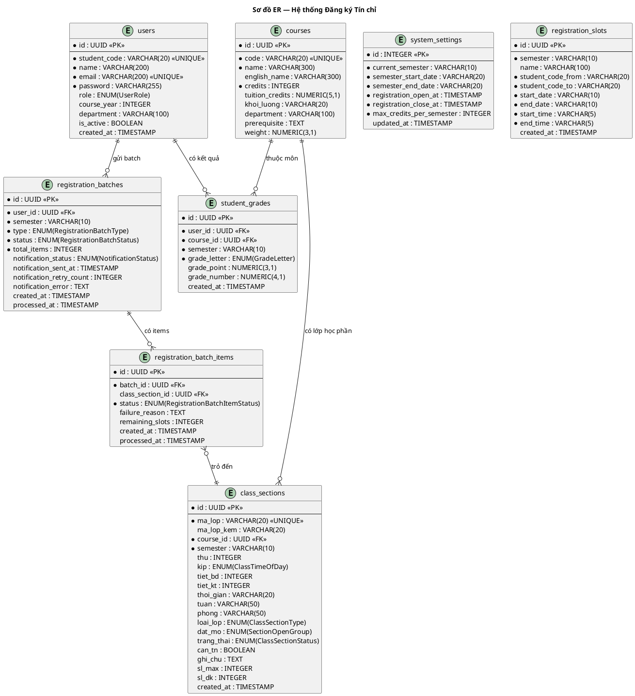

# Thiết kế Cơ sở dữ liệu

---

## 1. Sơ đồ ER (Entity Relationship Diagram)

> Paste vào https://www.plantuml.com/plantuml/uml/ để xem.

---

## 2. Mô tả chi tiết các bảng

### 2.1 Bảng `users` — Người dùng (Sinh viên & Admin)

| Cột | Kiểu | Ràng buộc | Mô tả |
|---|---|---|---|
| `id` | UUID | PK, DEFAULT | Khóa chính |
| `student_code` | VARCHAR(20) | UNIQUE, NOT NULL | Mã số sinh viên (VD: 20215678) |
| `name` | VARCHAR(200) | NOT NULL | Họ tên |
| `email` | VARCHAR(200) | UNIQUE, NOT NULL | Email |
| `password` | VARCHAR(255) | NOT NULL | Mật khẩu đã hash (bcrypt) |
| `role` | ENUM(UserRole) | DEFAULT STUDENT | STUDENT \| ADMIN |
| `course_year` | INTEGER | | Năm nhập học |
| `department` | VARCHAR(100) | | Viện/Khoa |
| `is_active` | BOOLEAN | DEFAULT TRUE | Tài khoản hoạt động |
| `created_at` | TIMESTAMP | DEFAULT NOW() | Thời điểm tạo |

---

### 2.2 Bảng `courses` — Môn học

| Cột | Kiểu | Ràng buộc | Mô tả |
|---|---|---|---|
| `id` | UUID | PK | Khóa chính |
| `code` | VARCHAR(20) | UNIQUE, NOT NULL | Mã học phần (VD: AC2070) |
| `name` | VARCHAR(300) | NOT NULL | Tên môn học |
| `english_name` | VARCHAR(300) | | Tên tiếng Anh |
| `credits` | INTEGER | NOT NULL | Số tín chỉ học tập |
| `tuition_credits` | NUMERIC(5,1) | | Số tín chỉ học phí |
| `khoi_luong` | VARCHAR(20) | | Khối lượng (VD: 3(2-1-1-6)) |
| `department` | VARCHAR(100) | | Viện/Khoa quản lý |
| `prerequisite` | TEXT | | Mã môn tiên quyết |
| `weight` | NUMERIC(3,1) | DEFAULT 1 | Hệ số ưu tiên |

---

### 2.3 Bảng `class_sections` — Lớp học phần

| Cột | Kiểu | Ràng buộc | Mô tả |
|---|---|---|---|
| `id` | UUID | PK | Khóa chính |
| `ma_lop` | VARCHAR(20) | UNIQUE, NOT NULL | Mã lớp (VD: 169995) |
| `ma_lop_kem` | VARCHAR(20) | | Mã lớp lý thuyết đi kèm |
| `course_id` | UUID | FK → courses | Môn học |
| `semester` | VARCHAR(10) | NOT NULL | Học kỳ (VD: 20252) |
| `thu` | INTEGER | | Thứ trong tuần (2–7) |
| `kip` | ENUM(ClassTimeOfDay) | | Sáng \| Chiều \| Tối |
| `tiet_bd` | INTEGER | | Tiết bắt đầu (1–6) |
| `tiet_kt` | INTEGER | | Tiết kết thúc (1–6) |
| `thoi_gian` | VARCHAR(20) | | Giờ học raw (VD: 0645-0910) |
| `tuan` | VARCHAR(50) | | Tuần học (VD: 25-32,34-42) |
| `phong` | VARCHAR(50) | | Phòng học |
| `loai_lop` | ENUM(ClassSectionType)| | LT+BT \| TN \| ĐA \| TT ... |
| `dat_mo` | ENUM(SectionOpenGroup) | | A \| B \| AB |
| `trang_thai` | ENUM(ClassSectionStatus)| | Điều chỉnh ĐK \| Hủy lớp ... |
| `can_tn` | BOOLEAN | DEFAULT FALSE | Bắt buộc đăng ký kèm lớp TN |
| `ghi_chu` | TEXT | | Ghi chú |
| `sl_max` | INTEGER | DEFAULT 0 | Sĩ số tối đa |
| `sl_dk` | INTEGER | DEFAULT 0 | Số đã đăng ký |

---

### 2.4 Bảng `registration_batches` — Batch đăng ký / hủy

| Cột | Kiểu | Ràng buộc | Mô tả |
|---|---|---|---|
| `id` | UUID | PK | Khóa chính |
| `user_id` | UUID | FK → users, NOT NULL | Sinh viên gửi batch |
| `semester` | VARCHAR(10) | NOT NULL | Học kỳ |
| `type` | ENUM(RegistrationBatchType)| NOT NULL | `CREATE` \| `CANCEL` |
| `status` | ENUM(RegistrationBatchStatus)| NOT NULL | `PENDING` \| `COMPLETED` |
| `total_items` | INTEGER | NOT NULL | Tổng số lớp trong batch |
| `notification_status` | ENUM(NotificationStatus)| DEFAULT PENDING| `PENDING` \| `SENT` \| `FAILED` |
| `notification_sent_at`| TIMESTAMP | | Thời gian gửi mail thành công |
| `notification_retry_count` | INTEGER | DEFAULT 0 | Số lần thử lại gửi mail |
| `notification_error` | TEXT | | Lỗi gửi mail nếu có |
| `created_at` | TIMESTAMP | DEFAULT NOW() | Thời điểm tạo |
| `processed_at` | TIMESTAMP | | Thời điểm worker xử lý xong |

---

### 2.4b Bảng `registration_batch_items` — Item trong batch

| Cột | Kiểu | Ràng buộc | Mô tả |
|---|---|---|---|
| `id` | UUID | PK | Khóa chính |
| `batch_id` | UUID | FK → registration_batches | Batch chứa item |
| `class_section_id` | UUID | FK → class_sections | Lớp học phần |
| `status` | ENUM(RegistrationBatchItemStatus)| NOT NULL | `PENDING` \| `SUCCESS` \| `FAILED` \| `CANCELLED` |
| `failure_reason` | TEXT | | Lý do thất bại |
| `remaining_slots` | INTEGER | | Slot còn lại sau xử lý |
| `created_at` | TIMESTAMP | DEFAULT NOW() | Thời điểm tạo |
| `processed_at` | TIMESTAMP | | Thời điểm worker xử lý item |

---

### 2.5 Bảng `student_grades` — Kết quả học tập

| Cột | Kiểu | Ràng buộc | Mô tả |
|---|---|---|---|
| `id` | UUID | PK | Khóa chính |
| `user_id` | UUID | FK → users | Sinh viên |
| `course_id` | UUID | FK → courses | Môn học |
| `semester` | VARCHAR(10) | NOT NULL | Học kỳ |
| `grade_letter` | ENUM(GradeLetter) | NOT NULL | A+ \| A \| B+ \| B \| C+ \| C \| D+ \| D \| F |
| `grade_point` | NUMERIC(3,1) | | Điểm thang 4 |
| `grade_number` | NUMERIC(4,1) | | Điểm số 0–10 |

---

### 2.6 Bảng `system_settings` — Cấu hình hệ thống (Singleton)

| Cột | Kiểu | Ràng buộc | Mô tả |
|---|---|---|---|
| `id` | INTEGER | PK, DEFAULT 1 | Luôn bằng 1 |
| `current_semester` | VARCHAR(10) | NOT NULL | Kỳ hiện tại |
| `semester_start_date`| VARCHAR(20) | NOT NULL | Ngày bắt đầu kỳ học |
| `semester_end_date` | VARCHAR(20) | NOT NULL | Ngày kết thúc kỳ học |
| `registration_open_at`| TIMESTAMP | NOT NULL | Thời gian mở hệ thống ĐK |
| `registration_close_at`| TIMESTAMP | NOT NULL | Thời gian đóng hệ thống ĐK |
| `max_credits_per_semester`| INTEGER | NOT NULL | Giới hạn tín chỉ tối đa |

---

### 2.7 Bảng `registration_slots` — Khung giờ đăng ký

| Cột | Kiểu | Ràng buộc | Mô tả |
|---|---|---|---|
| `id` | UUID | PK | Khóa chính |
| `semester` | VARCHAR(10) | NOT NULL | Kỳ học áp dụng |
| `name` | VARCHAR(100) | | Tên khung giờ |
| `student_code_from` | VARCHAR(20) | NOT NULL | MSSV từ... |
| `student_code_to` | VARCHAR(20) | NOT NULL | MSSV đến... |
| `start_date` | VARCHAR(10) | NOT NULL | Ngày bắt đầu (YYYY-MM-DD) |
| `end_date` | VARCHAR(10) | NOT NULL | Ngày kết thúc (YYYY-MM-DD) |
| `start_time` | VARCHAR(5) | NOT NULL | Giờ bắt đầu trong ngày (HH:mm) |
| `end_time` | VARCHAR(5) | NOT NULL | Giờ kết thúc trong ngày (HH:mm) |

---

## 3. Các ràng buộc nghiệp vụ quan trọng

| Ràng buộc | Bảng | Cách thực hiện |
|---|---|---|
| Không vượt sĩ số tối đa | class_sections | `UPDATE ... WHERE sl_dk < sl_max` trong transaction |
| Môn tiên quyết | student_grades | Lấy khóa ngoại hoặc check in-memory |
| Không trùng lịch | — | In-memory check lúc API tiếp nhận |
| Lớp TN đi kèm lý thuyết | class_sections | API validate `requiresLab` |
| Đăng ký và Thông báo | reg_batches | Worker xử lý xong cập nhật trạng thái Notification |
| Khung giờ phân loại sinh viên | reg_slots | Check `student_code` nằm trong khoảng `_from` và `_to` |
