# Sơ đồ tuần tự (Sequence Diagrams)

Tài liệu này mô tả các luồng chính đang có trong hệ thống đăng ký tín chỉ. Các sơ đồ dùng PlantUML và bám theo code hiện tại trong ba tiến trình:

- `apps/do-an`: API chính cho FE và Admin.
- `apps/worker`: consumer RabbitMQ xử lý batch đăng ký/hủy.
- `apps/scheduler`: cron prewarm/reconcile Redis và gửi thông báo.

> Ghi chú: các cache Redis chỉ là tối ưu đọc/fast-fail. Trạng thái cuối cùng vẫn được quyết định bởi PostgreSQL transaction.

---

## 1. Luồng xác thực

### 1.1 Đăng nhập

Sinh viên đăng nhập bằng MSSV và mật khẩu. Với sinh viên, hệ thống kiểm tra thêm khung đăng ký hiện tại trước khi cấp token.

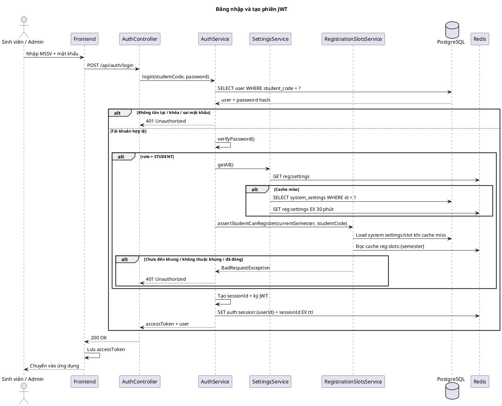
```plantuml
@startuml SD_Login
title Đăng nhập và tạo phiên JWT

actor "Sinh viên / Admin" as User
participant "Frontend" as FE
participant "AuthController" as AuthC
participant "AuthService" as AuthS
participant "SettingsService" as Settings
participant "RegistrationSlotsService" as Slots
database "PostgreSQL" as DB
participant "Redis" as Redis

User -> FE : Nhập MSSV + mật khẩu
FE -> AuthC : POST /api/auth/login
AuthC -> AuthS : login(studentCode, password)

AuthS -> DB : SELECT user WHERE student_code = ?
DB --> AuthS : user + password hash

alt Không tồn tại / khóa / sai mật khẩu
  AuthS --> AuthC : 401 Unauthorized
else Tài khoản hợp lệ
  AuthS -> AuthS : verifyPassword()
  alt role = STUDENT
    AuthS -> Settings : getAll()
    Settings -> Redis : GET reg:settings
    alt Cache miss
      Settings -> DB : SELECT system_settings WHERE id = 1
      Settings -> Redis : SET reg:settings EX 30 phút
    end
    AuthS -> Slots : assertStudentCanRegister(currentSemester, studentCode)
    Slots -> DB : Load system settings/slot khi cache miss
    Slots -> Redis : Đọc cache reg:slots:{semester}
    alt Chưa đến khung / không thuộc khung / đã đóng
      Slots --> AuthS : BadRequestException
      AuthS --> AuthC : 401 Unauthorized
    end
  end

  AuthS -> AuthS : Tạo sessionId + ký JWT
  AuthS -> Redis : SET auth:session:{userId} = sessionId EX ttl
  AuthS --> AuthC : accessToken + user
end

AuthC --> FE : 200 OK
FE -> FE : Lưu accessToken
FE --> User : Chuyển vào ứng dụng
@enduml
```

### 1.2 Kiểm tra token và đăng xuất

JWT có `sessionId`. Guard không chỉ verify chữ ký JWT mà còn kiểm tra session đang còn trong Redis. Đăng xuất xóa session key để token cũ không dùng tiếp được.

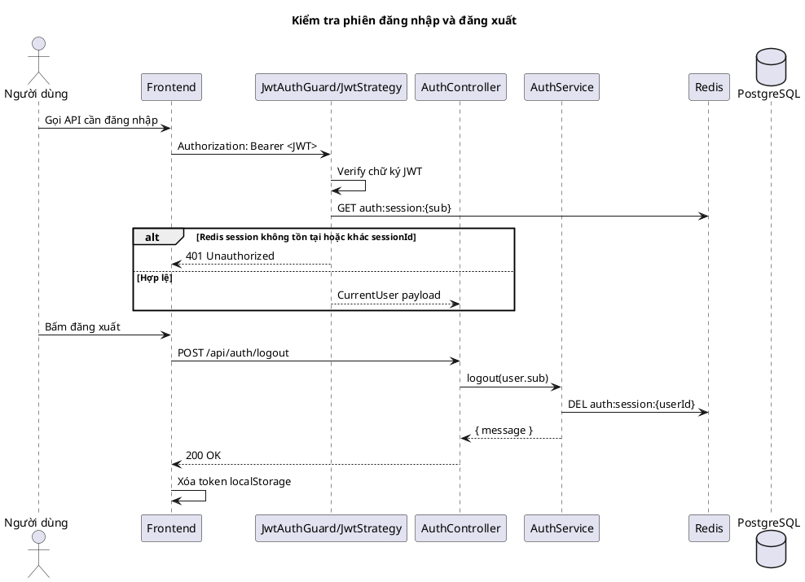
```plantuml
@startuml SD_AuthGuard_Logout
title Kiểm tra phiên đăng nhập và đăng xuất

actor "Người dùng" as User
participant "Frontend" as FE
participant "JwtAuthGuard/JwtStrategy" as Guard
participant "AuthController" as AuthC
participant "AuthService" as AuthS
participant "Redis" as Redis
database "PostgreSQL" as DB

User -> FE : Gọi API cần đăng nhập
FE -> Guard : Authorization: Bearer <JWT>
Guard -> Guard : Verify chữ ký JWT
Guard -> Redis : GET auth:session:{sub}

alt Redis session không tồn tại hoặc khác sessionId
  Guard --> FE : 401 Unauthorized
else Hợp lệ
  Guard --> AuthC : CurrentUser payload
end

User -> FE : Bấm đăng xuất
FE -> AuthC : POST /api/auth/logout
AuthC -> AuthS : logout(user.sub)
AuthS -> Redis : DEL auth:session:{userId}
AuthS --> AuthC : { message }
AuthC --> FE : 200 OK
FE -> FE : Xóa token localStorage
@enduml
```

---

## 2. Luồng sinh viên

### 2.1 Xem khung đăng ký hiện tại

Dashboard sinh viên gọi API để biết phiên đăng ký chung và khung cá nhân theo khoảng MSSV.

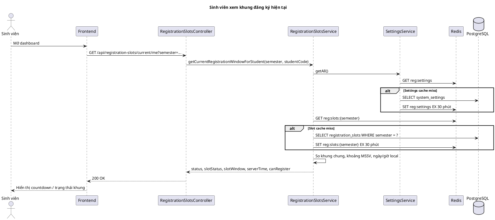
```plantuml
@startuml SD_CurrentRegistrationWindow
title Sinh viên xem khung đăng ký hiện tại

actor "Sinh viên" as SV
participant "Frontend" as FE
participant "RegistrationSlotsController" as SlotsC
participant "RegistrationSlotsService" as SlotsS
participant "SettingsService" as Settings
participant "Redis" as Redis
database "PostgreSQL" as DB

SV -> FE : Mở dashboard
FE -> SlotsC : GET /api/registration-slots/current/me?semester=...
SlotsC -> SlotsS : getCurrentRegistrationWindowForStudent(semester, studentCode)
SlotsS -> Settings : getAll()
Settings -> Redis : GET reg:settings
alt Settings cache miss
  Settings -> DB : SELECT system_settings
  Settings -> Redis : SET reg:settings EX 30 phút
end

SlotsS -> Redis : GET reg:slots:{semester}
alt Slot cache miss
  SlotsS -> DB : SELECT registration_slots WHERE semester = ?
  SlotsS -> Redis : SET reg:slots:{semester} EX 30 phút
end

SlotsS -> SlotsS : So khung chung, khoảng MSSV, ngày/giờ local
SlotsS --> SlotsC : status, slotStatus, slotWindow, serverTime, canRegister
SlotsC --> FE : 200 OK
FE --> SV : Hiển thị countdown / trạng thái khung
@enduml
```

### 2.2 Tra cứu môn học và lớp học phần

Read-path dùng cache Redis để giảm tải DB. Cache được xóa khi import/create/update/delete qua API.

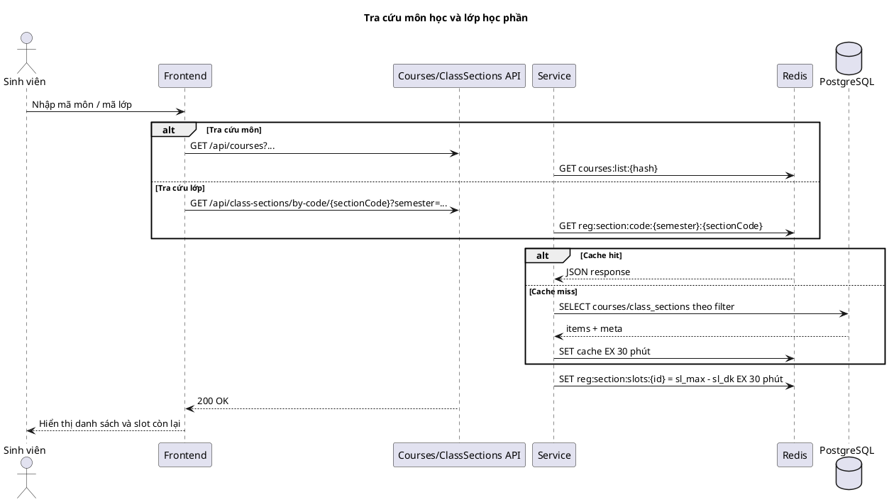
```plantuml
@startuml SD_LookupClassSections
title Tra cứu môn học và lớp học phần

actor "Sinh viên" as SV
participant "Frontend" as FE
participant "Courses/ClassSections API" as API
participant "Service" as Service
participant "Redis" as Redis
database "PostgreSQL" as DB

SV -> FE : Nhập mã môn / mã lớp
alt Tra cứu môn
  FE -> API : GET /api/courses?...
  Service -> Redis : GET courses:list:{hash}
else Tra cứu lớp
  FE -> API : GET /api/class-sections/by-code/{sectionCode}?semester=...
  Service -> Redis : GET reg:section:code:{semester}:{sectionCode}
end

alt Cache hit
  Redis --> Service : JSON response
else Cache miss
  Service -> DB : SELECT courses/class_sections theo filter
  DB --> Service : items + meta
  Service -> Redis : SET cache EX 30 phút
end

Service -> Redis : SET reg:section:slots:{id} = sl_max - sl_dk EX 30 phút
API --> FE : 200 OK
FE --> SV : Hiển thị danh sách và slot còn lại
@enduml
```

### 2.3 Đăng ký tín chỉ

Write-path của đăng ký không dựa vào cache lookup để quyết định trạng thái lớp. API resolve mã lớp từ DB, sau đó mới refresh cache. Slot Redis chỉ dùng để fast-fail và giữ chỗ tạm thời; Worker vẫn cập nhật DB bằng atomic update.

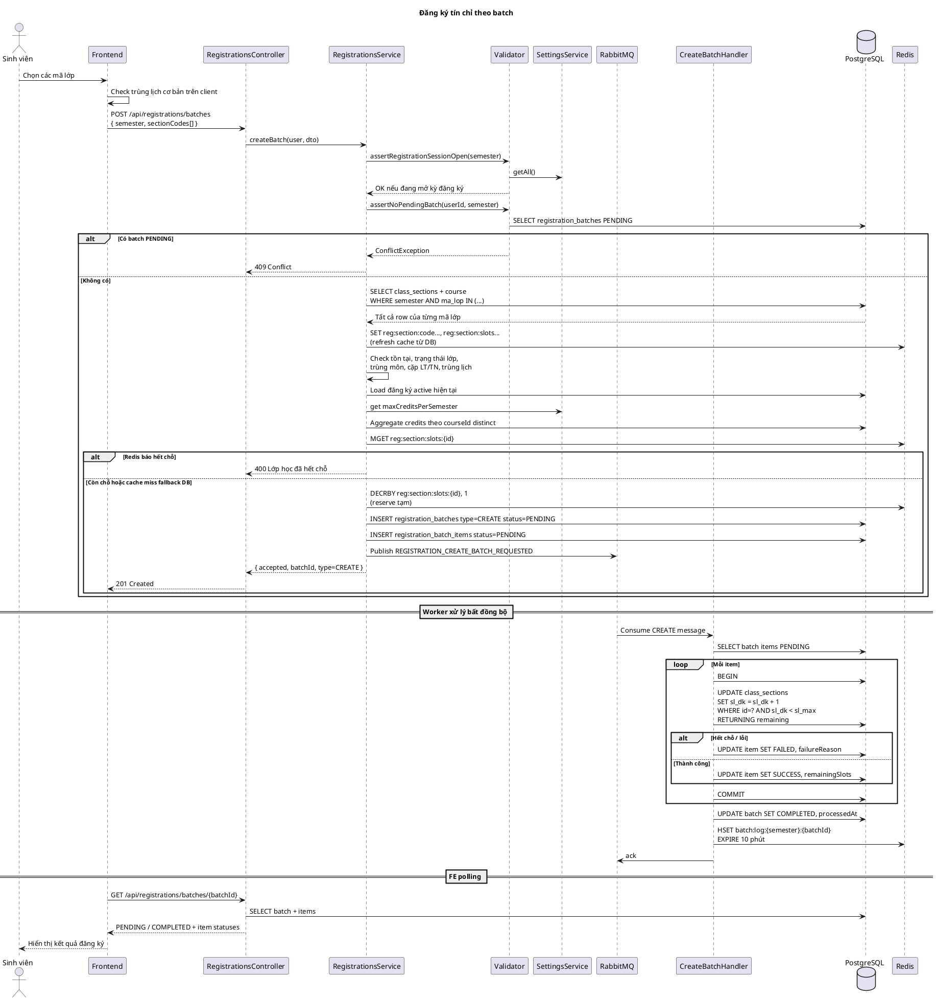
```plantuml
@startuml SD_CreateRegistrationBatch
title Đăng ký tín chỉ theo batch

actor "Sinh viên" as SV
participant "Frontend" as FE
participant "RegistrationsController" as RegC
participant "RegistrationsService" as RegS
participant "Validator" as Validator
participant "SettingsService" as Settings
participant "RabbitMQ" as MQ
participant "CreateBatchHandler" as Worker
database "PostgreSQL" as DB
participant "Redis" as Redis

SV -> FE : Chọn các mã lớp
FE -> FE : Check trùng lịch cơ bản trên client
FE -> RegC : POST /api/registrations/batches\n{ semester, sectionCodes[] }
RegC -> RegS : createBatch(user, dto)

RegS -> Validator : assertRegistrationSessionOpen(semester)
Validator -> Settings : getAll()
Validator --> RegS : OK nếu đang mở kỳ đăng ký

RegS -> Validator : assertNoPendingBatch(userId, semester)
Validator -> DB : SELECT registration_batches PENDING
alt Có batch PENDING
  Validator --> RegS : ConflictException
  RegS --> RegC : 409 Conflict
else Không có
  RegS -> DB : SELECT class_sections + course\nWHERE semester AND ma_lop IN (...)
  DB --> RegS : Tất cả row của từng mã lớp
  RegS -> Redis : SET reg:section:code..., reg:section:slots...\n(refresh cache từ DB)

  RegS -> RegS : Check tồn tại, trạng thái lớp,\ntrùng môn, cặp LT/TN, trùng lịch
  RegS -> DB : Load đăng ký active hiện tại
  RegS -> Settings : get maxCreditsPerSemester
  RegS -> DB : Aggregate credits theo courseId distinct

  RegS -> Redis : MGET reg:section:slots:{id}
  alt Redis báo hết chỗ
    RegS --> RegC : 400 Lớp học đã hết chỗ
  else Còn chỗ hoặc cache miss fallback DB
    RegS -> Redis : DECRBY reg:section:slots:{id}, 1\n(reserve tạm)
    RegS -> DB : INSERT registration_batches type=CREATE status=PENDING
    RegS -> DB : INSERT registration_batch_items status=PENDING
    RegS -> MQ : Publish REGISTRATION_CREATE_BATCH_REQUESTED
    RegS --> RegC : { accepted, batchId, type=CREATE }
    RegC --> FE : 201 Created
  end
end

== Worker xử lý bất đồng bộ ==

MQ -> Worker : Consume CREATE message
Worker -> DB : SELECT batch items PENDING

loop Mỗi item
  Worker -> DB : BEGIN
  Worker -> DB : UPDATE class_sections\nSET sl_dk = sl_dk + 1\nWHERE id=? AND sl_dk < sl_max\nRETURNING remaining
  alt Hết chỗ / lỗi
    Worker -> DB : UPDATE item SET FAILED, failureReason
  else Thành công
    Worker -> DB : UPDATE item SET SUCCESS, remainingSlots
  end
  Worker -> DB : COMMIT
end

Worker -> DB : UPDATE batch SET COMPLETED, processedAt
Worker -> Redis : HSET batch:log:{semester}:{batchId}\nEXPIRE 10 phút
Worker -> MQ : ack

== FE polling ==

FE -> RegC : GET /api/registrations/batches/{batchId}
RegC -> DB : SELECT batch + items
RegC --> FE : PENDING / COMPLETED + item statuses
FE --> SV : Hiển thị kết quả đăng ký
@enduml
```

### 2.4 Hủy đăng ký tín chỉ

Hủy đăng ký cũng đi qua batch riêng loại `CANCEL`. API tìm item đăng ký gốc đang active, tạo batch hủy và gửi `sourceItemId` cho Worker. Worker cập nhật item gốc sang `CANCELLED`, còn item trong batch hủy sang `SUCCESS`.

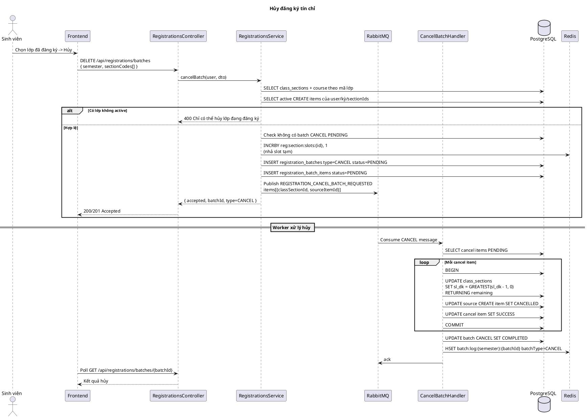
```plantuml
@startuml SD_CancelRegistrationBatch
title Hủy đăng ký tín chỉ

actor "Sinh viên" as SV
participant "Frontend" as FE
participant "RegistrationsController" as RegC
participant "RegistrationsService" as RegS
participant "RabbitMQ" as MQ
participant "CancelBatchHandler" as Worker
database "PostgreSQL" as DB
participant "Redis" as Redis

SV -> FE : Chọn lớp đã đăng ký -> Hủy
FE -> RegC : DELETE /api/registrations/batches\n{ semester, sectionCodes[] }
RegC -> RegS : cancelBatch(user, dto)

RegS -> DB : SELECT class_sections + course theo mã lớp
RegS -> DB : SELECT active CREATE items của user/kỳ/sectionIds
alt Có lớp không active
  RegS --> RegC : 400 Chỉ có thể hủy lớp đang đăng ký
else Hợp lệ
  RegS -> DB : Check không có batch CANCEL PENDING
  RegS -> Redis : INCRBY reg:section:slots:{id}, 1\n(nhả slot tạm)
  RegS -> DB : INSERT registration_batches type=CANCEL status=PENDING
  RegS -> DB : INSERT registration_batch_items status=PENDING
  RegS -> MQ : Publish REGISTRATION_CANCEL_BATCH_REQUESTED\nitems[{classSectionId, sourceItemId}]
  RegS --> RegC : { accepted, batchId, type=CANCEL }
  RegC --> FE : 200/201 Accepted
end

== Worker xử lý hủy ==

MQ -> Worker : Consume CANCEL message
Worker -> DB : SELECT cancel items PENDING

loop Mỗi cancel item
  Worker -> DB : BEGIN
  Worker -> DB : UPDATE class_sections\nSET sl_dk = GREATEST(sl_dk - 1, 0)\nRETURNING remaining
  Worker -> DB : UPDATE source CREATE item SET CANCELLED
  Worker -> DB : UPDATE cancel item SET SUCCESS
  Worker -> DB : COMMIT
end

Worker -> DB : UPDATE batch CANCEL SET COMPLETED
Worker -> Redis : HSET batch:log:{semester}:{batchId} batchType=CANCEL
Worker -> MQ : ack
FE -> RegC : Poll GET /api/registrations/batches/{batchId}
RegC --> FE : Kết quả hủy
@enduml
```

### 2.5 Xem danh sách đăng ký và lịch học của tôi

FE gọi `/api/registrations/my`. API lấy kết quả mới nhất theo từng class section từ batch `CREATE`; FE lọc item `SUCCESS` chưa bị hủy để hiển thị lịch học và tổng tín chỉ.

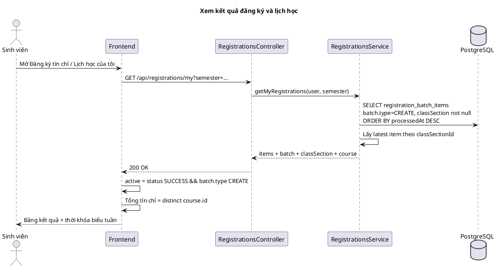
```plantuml
@startuml SD_MyRegistrations
title Xem kết quả đăng ký và lịch học

actor "Sinh viên" as SV
participant "Frontend" as FE
participant "RegistrationsController" as RegC
participant "RegistrationsService" as RegS
database "PostgreSQL" as DB

SV -> FE : Mở Đăng ký tín chỉ / Lịch học của tôi
FE -> RegC : GET /api/registrations/my?semester=...
RegC -> RegS : getMyRegistrations(user, semester)
RegS -> DB : SELECT registration_batch_items\nbatch.type=CREATE, classSection not null\nORDER BY processedAt DESC
RegS -> RegS : Lấy latest item theo classSectionId
RegS --> RegC : items + batch + classSection + course
RegC --> FE : 200 OK
FE -> FE : active = status SUCCESS && batch.type CREATE
FE -> FE : Tổng tín chỉ = distinct course.id
FE --> SV : Bảng kết quả + thời khóa biểu tuần
@enduml
```

---

## 3. Luồng quản trị

### 3.1 Cấu hình học kỳ và phiên đăng ký

Admin cập nhật settings. Service validate khoảng thời gian và ghi lại cache `reg:settings`.

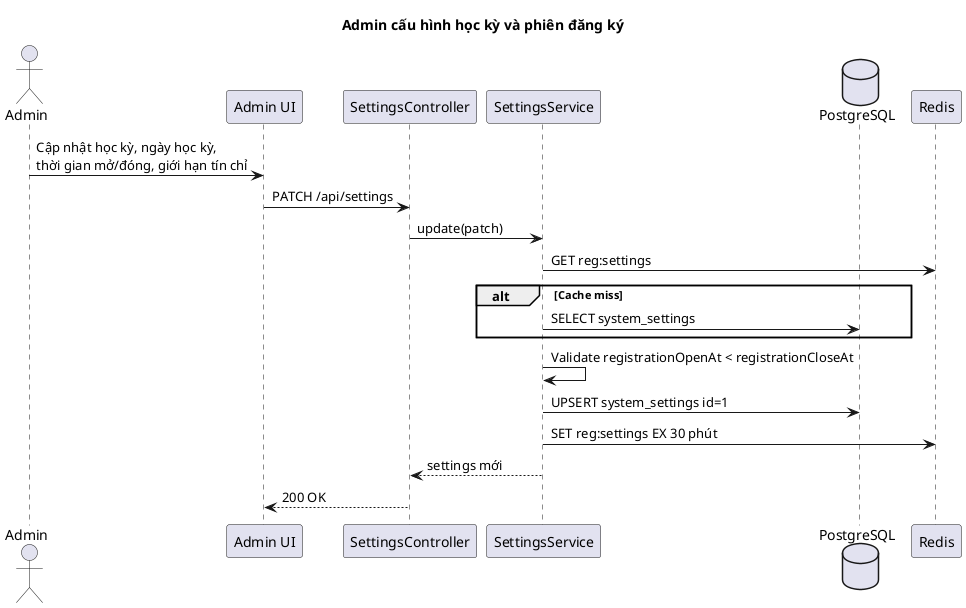
```plantuml
@startuml SD_Settings
title Admin cấu hình học kỳ và phiên đăng ký

actor "Admin" as Admin
participant "Admin UI" as FE
participant "SettingsController" as SettingsC
participant "SettingsService" as SettingsS
database "PostgreSQL" as DB
participant "Redis" as Redis

Admin -> FE : Cập nhật học kỳ, ngày học kỳ,\nthời gian mở/đóng, giới hạn tín chỉ
FE -> SettingsC : PATCH /api/settings
SettingsC -> SettingsS : update(patch)
SettingsS -> Redis : GET reg:settings
alt Cache miss
  SettingsS -> DB : SELECT system_settings
end
SettingsS -> SettingsS : Validate registrationOpenAt < registrationCloseAt
SettingsS -> DB : UPSERT system_settings id=1
SettingsS -> Redis : SET reg:settings EX 30 phút
SettingsS --> SettingsC : settings mới
SettingsC --> FE : 200 OK
@enduml
```

### 3.2 Quản lý khung đăng ký theo MSSV

Slot đăng ký giới hạn sinh viên theo khoảng MSSV, ngày và giờ trong ngày. Mỗi lần tạo/sửa/xóa slot sẽ xóa cache slot của kỳ.

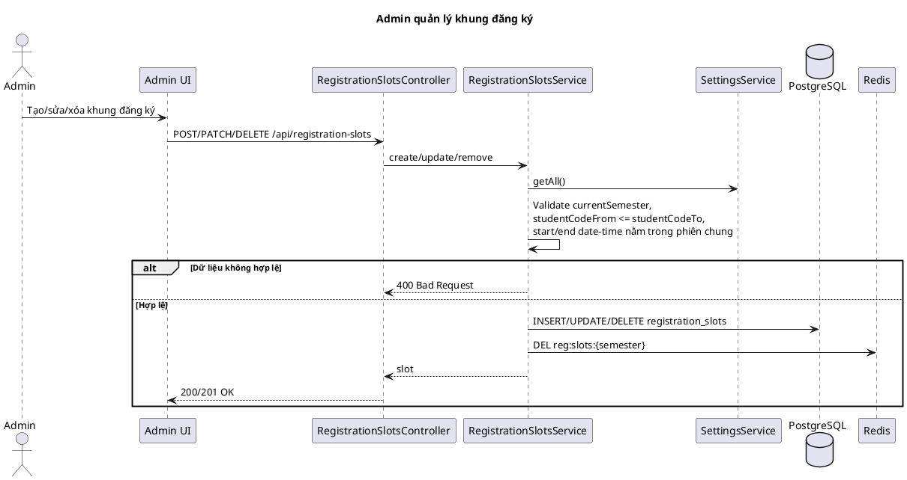
```plantuml
@startuml SD_RegistrationSlotsAdmin
title Admin quản lý khung đăng ký

actor "Admin" as Admin
participant "Admin UI" as FE
participant "RegistrationSlotsController" as SlotsC
participant "RegistrationSlotsService" as SlotsS
participant "SettingsService" as Settings
database "PostgreSQL" as DB
participant "Redis" as Redis

Admin -> FE : Tạo/sửa/xóa khung đăng ký
FE -> SlotsC : POST/PATCH/DELETE /api/registration-slots
SlotsC -> SlotsS : create/update/remove
SlotsS -> Settings : getAll()
SlotsS -> SlotsS : Validate currentSemester,\nstudentCodeFrom <= studentCodeTo,\nstart/end date-time nằm trong phiên chung

alt Dữ liệu không hợp lệ
  SlotsS --> SlotsC : 400 Bad Request
else Hợp lệ
  SlotsS -> DB : INSERT/UPDATE/DELETE registration_slots
  SlotsS -> Redis : DEL reg:slots:{semester}
  SlotsS --> SlotsC : slot
  SlotsC --> FE : 200/201 OK
end
@enduml
```

### 3.3 Import danh mục môn học

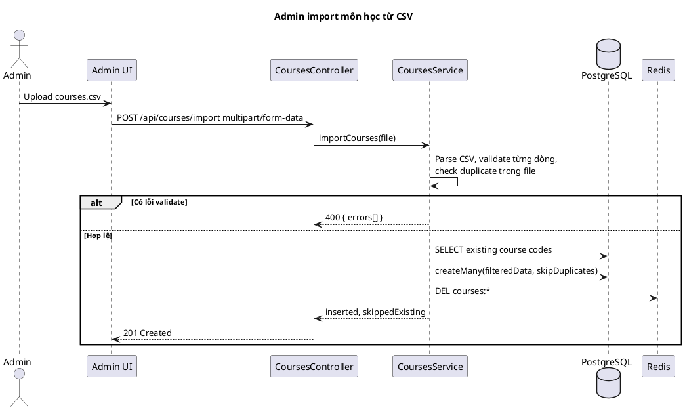
```plantuml
@startuml SD_ImportCourses
title Admin import môn học từ CSV

actor "Admin" as Admin
participant "Admin UI" as FE
participant "CoursesController" as CoursesC
participant "CoursesService" as CoursesS
database "PostgreSQL" as DB
participant "Redis" as Redis

Admin -> FE : Upload courses.csv
FE -> CoursesC : POST /api/courses/import multipart/form-data
CoursesC -> CoursesS : importCourses(file)
CoursesS -> CoursesS : Parse CSV, validate từng dòng,\ncheck duplicate trong file
alt Có lỗi validate
  CoursesS --> CoursesC : 400 { errors[] }
else Hợp lệ
  CoursesS -> DB : SELECT existing course codes
  CoursesS -> DB : createMany(filteredData, skipDuplicates)
  CoursesS -> Redis : DEL courses:*
  CoursesS --> CoursesC : inserted, skippedExisting
  CoursesC --> FE : 201 Created
end
@enduml
```

### 3.4 Import lớp học phần

Import lớp học phần phụ thuộc vào danh mục môn học đã tồn tại. Sau khi import, service xóa cache lookup/list/slot liên quan.

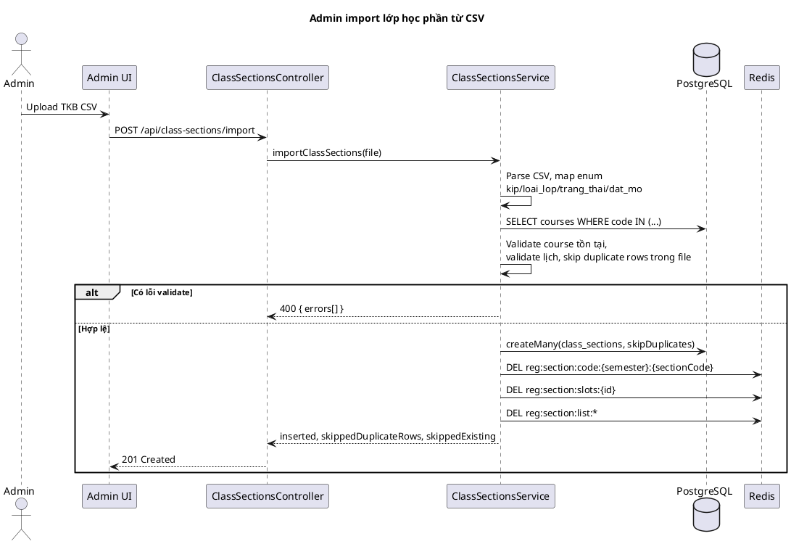
```plantuml
@startuml SD_ImportClassSections
title Admin import lớp học phần từ CSV

actor "Admin" as Admin
participant "Admin UI" as FE
participant "ClassSectionsController" as ClassC
participant "ClassSectionsService" as ClassS
database "PostgreSQL" as DB
participant "Redis" as Redis

Admin -> FE : Upload TKB CSV
FE -> ClassC : POST /api/class-sections/import
ClassC -> ClassS : importClassSections(file)
ClassS -> ClassS : Parse CSV, map enum\nkip/loai_lop/trang_thai/dat_mo
ClassS -> DB : SELECT courses WHERE code IN (...)
ClassS -> ClassS : Validate course tồn tại,\nvalidate lịch, skip duplicate rows trong file

alt Có lỗi validate
  ClassS --> ClassC : 400 { errors[] }
else Hợp lệ
  ClassS -> DB : createMany(class_sections, skipDuplicates)
  ClassS -> Redis : DEL reg:section:code:{semester}:{sectionCode}
  ClassS -> Redis : DEL reg:section:slots:{id}
  ClassS -> Redis : DEL reg:section:list:*
  ClassS --> ClassC : inserted, skippedDuplicateRows, skippedExisting
  ClassC --> FE : 201 Created
end
@enduml
```

### 3.5 Quản lý tài khoản sinh viên

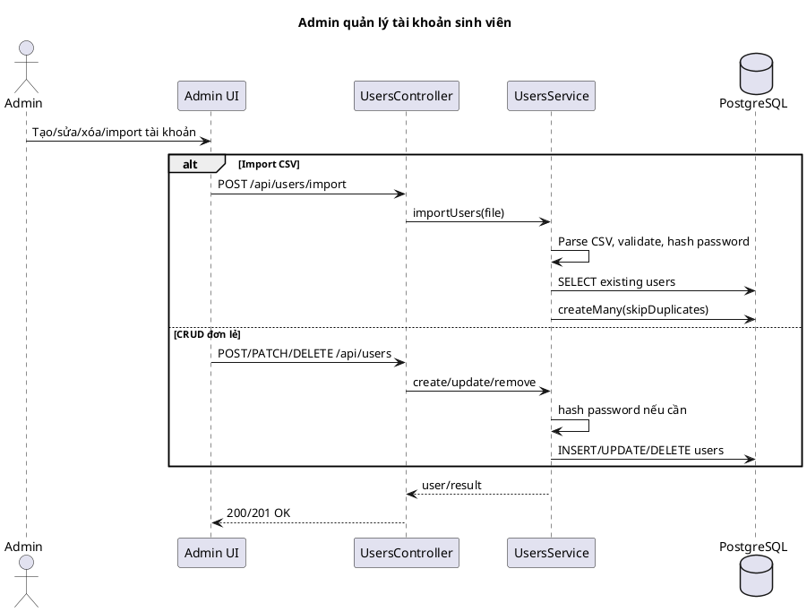
```plantuml
@startuml SD_UserManagement
title Admin quản lý tài khoản sinh viên

actor "Admin" as Admin
participant "Admin UI" as FE
participant "UsersController" as UsersC
participant "UsersService" as UsersS
database "PostgreSQL" as DB

Admin -> FE : Tạo/sửa/xóa/import tài khoản
alt Import CSV
  FE -> UsersC : POST /api/users/import
  UsersC -> UsersS : importUsers(file)
  UsersS -> UsersS : Parse CSV, validate, hash password
  UsersS -> DB : SELECT existing users
  UsersS -> DB : createMany(skipDuplicates)
else CRUD đơn lẻ
  FE -> UsersC : POST/PATCH/DELETE /api/users
  UsersC -> UsersS : create/update/remove
  UsersS -> UsersS : hash password nếu cần
  UsersS -> DB : INSERT/UPDATE/DELETE users
end
UsersS --> UsersC : user/result
UsersC --> FE : 200/201 OK
@enduml
```

### 3.6 Quản lý điểm

Điểm được dùng trong kiểm tra tiên quyết ở Worker/API khi đăng ký.

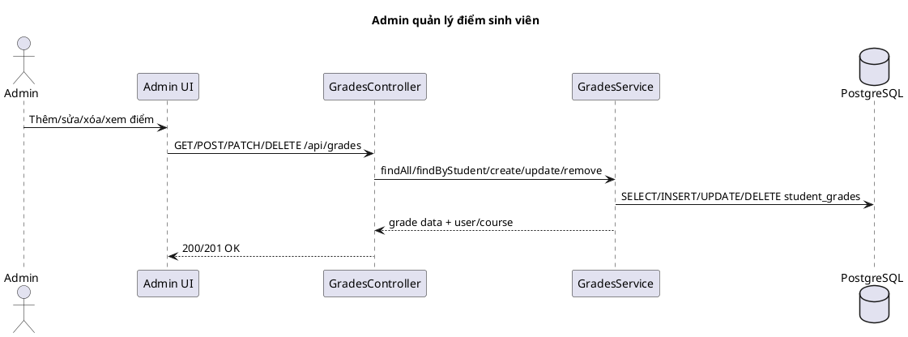
```plantuml
@startuml SD_Grades
title Admin quản lý điểm sinh viên

actor "Admin" as Admin
participant "Admin UI" as FE
participant "GradesController" as GradesC
participant "GradesService" as GradesS
database "PostgreSQL" as DB

Admin -> FE : Thêm/sửa/xóa/xem điểm
FE -> GradesC : GET/POST/PATCH/DELETE /api/grades
GradesC -> GradesS : findAll/findByStudent/create/update/remove
GradesS -> DB : SELECT/INSERT/UPDATE/DELETE student_grades
GradesS --> GradesC : grade data + user/course
GradesC --> FE : 200/201 OK
@enduml
```

### 3.7 Dashboard vận hành

Dashboard lấy metric runtime từ Redis log batch và request counter, kết hợp các số liệu tổng từ DB.

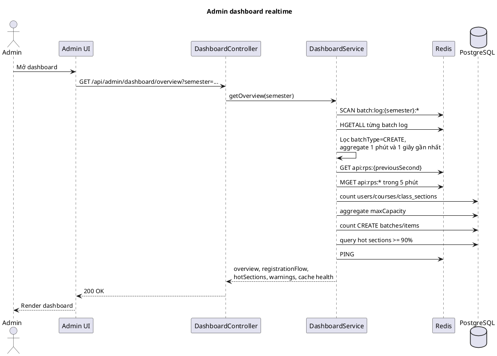
```plantuml
@startuml SD_AdminDashboard
title Admin dashboard realtime

actor "Admin" as Admin
participant "Admin UI" as FE
participant "DashboardController" as DashC
participant "DashboardService" as DashS
participant "Redis" as Redis
database "PostgreSQL" as DB

Admin -> FE : Mở dashboard
FE -> DashC : GET /api/admin/dashboard/overview?semester=...
DashC -> DashS : getOverview(semester)

DashS -> Redis : SCAN batch:log:{semester}:*
DashS -> Redis : HGETALL từng batch log
DashS -> DashS : Lọc batchType=CREATE,\naggregate 1 phút và 1 giây gần nhất
DashS -> Redis : GET api:rps:{previousSecond}
DashS -> Redis : MGET api:rps:* trong 5 phút

DashS -> DB : count users/courses/class_sections
DashS -> DB : aggregate maxCapacity
DashS -> DB : count CREATE batches/items
DashS -> DB : query hot sections >= 90%
DashS -> Redis : PING

DashS --> DashC : overview, registrationFlow,\nhotSections, warnings, cache health
DashC --> FE : 200 OK
FE --> Admin : Render dashboard
@enduml
```

### 3.8 Reset dữ liệu test

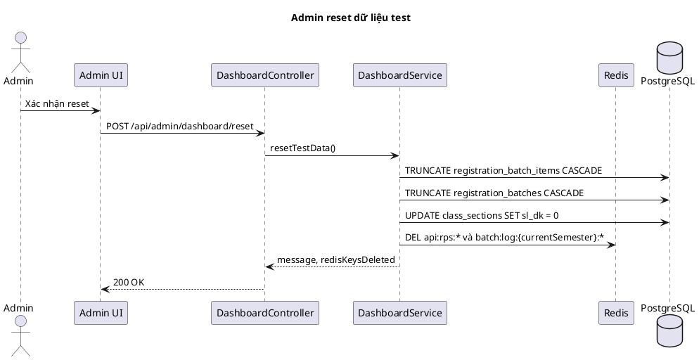
```plantuml
@startuml SD_ResetTestData
title Admin reset dữ liệu test

actor "Admin" as Admin
participant "Admin UI" as FE
participant "DashboardController" as DashC
participant "DashboardService" as DashS
participant "Redis" as Redis
database "PostgreSQL" as DB

Admin -> FE : Xác nhận reset
FE -> DashC : POST /api/admin/dashboard/reset
DashC -> DashS : resetTestData()
DashS -> DB : TRUNCATE registration_batch_items CASCADE
DashS -> DB : TRUNCATE registration_batches CASCADE
DashS -> DB : UPDATE class_sections SET sl_dk = 0
DashS -> Redis : DEL api:rps:* và batch:log:{currentSemester}:*
DashS --> DashC : message, redisKeysDeleted
DashC --> FE : 200 OK
@enduml
```

---

## 4. Luồng hệ thống chạy nền

### 4.1 Prewarm và heal Redis cache

Scheduler không prewarm toàn bộ mỗi phút. Cron mỗi phút gọi `healIfNeeded()`: nếu còn trong giai đoạn đăng ký và một slot key mẫu bị miss, service mới prewarm toàn bộ lớp của kỳ hiện tại.

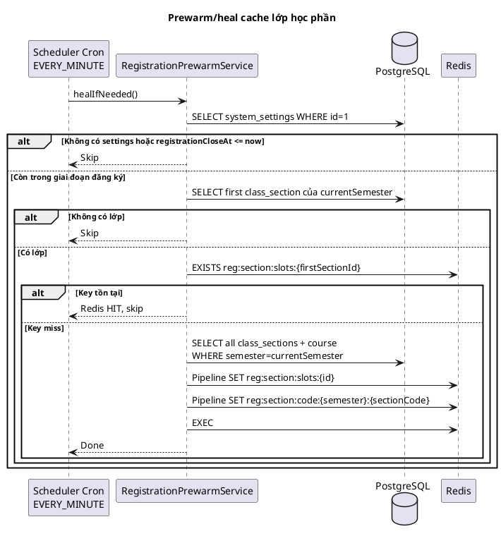
```plantuml
@startuml SD_PrewarmHeal
title Prewarm/heal cache lớp học phần

participant "Scheduler Cron\nEVERY_MINUTE" as Cron
participant "RegistrationPrewarmService" as Prewarm
database "PostgreSQL" as DB
participant "Redis" as Redis

Cron -> Prewarm : healIfNeeded()
Prewarm -> DB : SELECT system_settings WHERE id=1

alt Không có settings hoặc registrationCloseAt <= now
  Prewarm --> Cron : Skip
else Còn trong giai đoạn đăng ký
  Prewarm -> DB : SELECT first class_section của currentSemester
  alt Không có lớp
    Prewarm --> Cron : Skip
  else Có lớp
    Prewarm -> Redis : EXISTS reg:section:slots:{firstSectionId}
    alt Key tồn tại
      Prewarm --> Cron : Redis HIT, skip
    else Key miss
      Prewarm -> DB : SELECT all class_sections + course\nWHERE semester=currentSemester
      Prewarm -> Redis : Pipeline SET reg:section:slots:{id}
      Prewarm -> Redis : Pipeline SET reg:section:code:{semester}:{sectionCode}
      Prewarm -> Redis : EXEC
      Prewarm --> Cron : Done
    end
  end
end
@enduml
```

**Ghi chú kiểm tra logic prewarm**

- Prewarm ghi cả slot cache và lookup-by-code cache với TTL 30 phút.
- `healIfNeeded()` chỉ kiểm tra một slot key mẫu. Nếu key mẫu còn nhưng một phần cache khác mất, cron sẽ không prewarm lại toàn bộ.
- `reconcileRedisSlots()` chỉ đồng bộ slot cache, không đồng bộ `reg:section:code:*`.
- Với write-path đăng ký, API đã resolve mã lớp từ DB rồi refresh cache nên không bị quyết định bởi lookup cache cũ.
- Nếu sửa dữ liệu trực tiếp trong DB, bỏ qua API, cache lookup có thể stale cho đến khi TTL hết hoặc prewarm/cache key bị xóa thủ công.

### 4.2 Reconcile slot cache

Cron mỗi 10 phút đồng bộ lại số slot còn trống trong Redis theo DB để sửa các lệch do lỗi publish, rollback hoặc Redis restart.

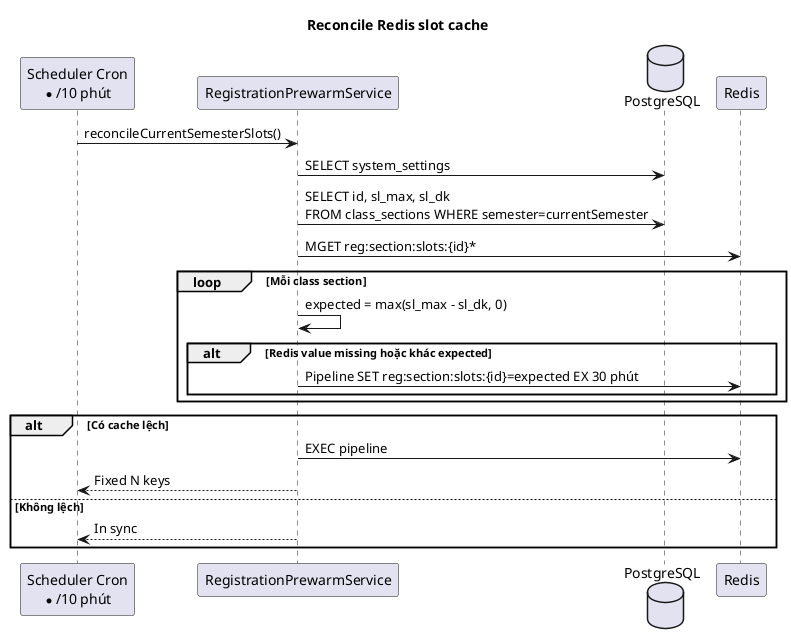
```plantuml
@startuml SD_ReconcileSlots
title Reconcile Redis slot cache

participant "Scheduler Cron\n*/10 phút" as Cron
participant "RegistrationPrewarmService" as Prewarm
database "PostgreSQL" as DB
participant "Redis" as Redis

Cron -> Prewarm : reconcileCurrentSemesterSlots()
Prewarm -> DB : SELECT system_settings
Prewarm -> DB : SELECT id, sl_max, sl_dk\nFROM class_sections WHERE semester=currentSemester
Prewarm -> Redis : MGET reg:section:slots:{id}*

loop Mỗi class section
  Prewarm -> Prewarm : expected = max(sl_max - sl_dk, 0)
  alt Redis value missing hoặc khác expected
    Prewarm -> Redis : Pipeline SET reg:section:slots:{id}=expected EX 30 phút
  end
end

alt Có cache lệch
  Prewarm -> Redis : EXEC pipeline
  Prewarm --> Cron : Fixed N keys
else Không lệch
  Prewarm --> Cron : In sync
end
@enduml
```

### 4.3 Retry và dead-letter của Worker

Consumer RabbitMQ retry tối đa theo header. Nếu quá số lần retry, message được đưa vào dead-letter queue.

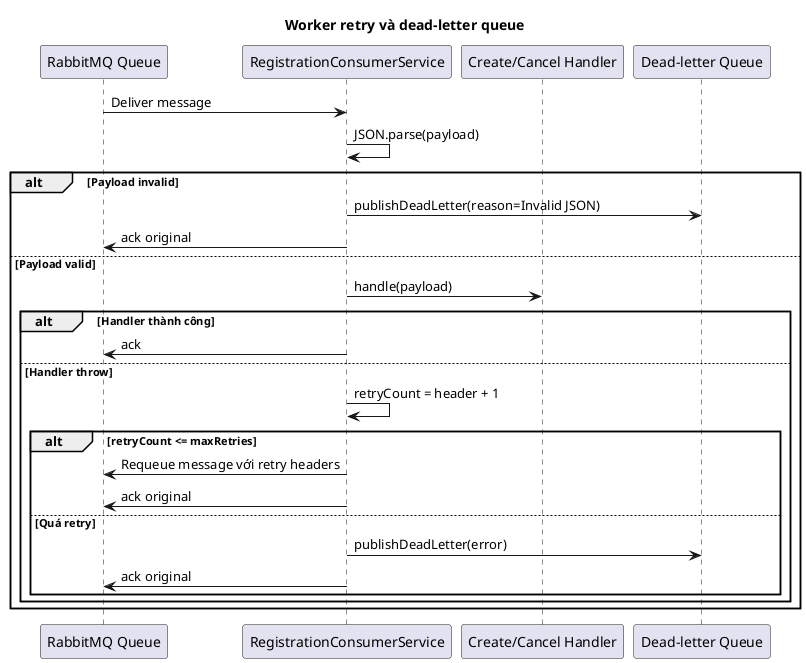
```plantuml
@startuml SD_WorkerRetry
title Worker retry và dead-letter queue

participant "RabbitMQ Queue" as Queue
participant "RegistrationConsumerService" as Consumer
participant "Create/Cancel Handler" as Handler
participant "Dead-letter Queue" as DLQ

Queue -> Consumer : Deliver message
Consumer -> Consumer : JSON.parse(payload)

alt Payload invalid
  Consumer -> DLQ : publishDeadLetter(reason=Invalid JSON)
  Consumer -> Queue : ack original
else Payload valid
  Consumer -> Handler : handle(payload)
  alt Handler thành công
    Consumer -> Queue : ack
  else Handler throw
    Consumer -> Consumer : retryCount = header + 1
    alt retryCount <= maxRetries
      Consumer -> Queue : Requeue message với retry headers
      Consumer -> Queue : ack original
    else Quá retry
      Consumer -> DLQ : publishDeadLetter(error)
      Consumer -> Queue : ack original
    end
  end
end
@enduml
```

### 4.4 Gửi email tổng kết đăng ký

Scheduler gom các batch đã hoàn tất nhưng chưa gửi email. Email chỉ gửi khi khung đăng ký của sinh viên đã ngoài thời gian hiện tại, nhằm gửi một bản tổng kết sau khi sinh viên hết lượt.

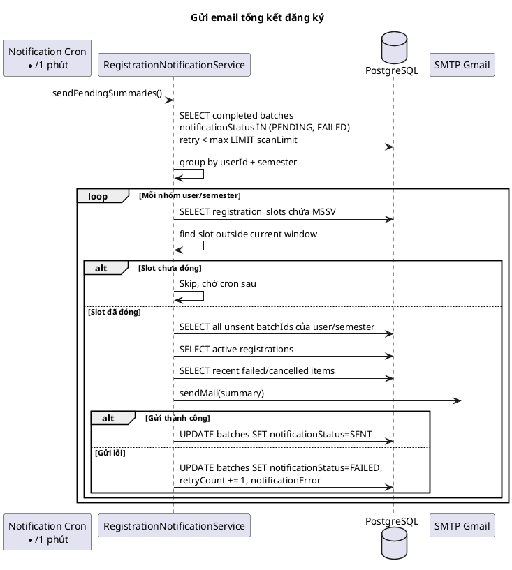
```plantuml
@startuml SD_NotificationSummary
title Gửi email tổng kết đăng ký

participant "Notification Cron\n*/1 phút" as Cron
participant "RegistrationNotificationService" as NotiS
database "PostgreSQL" as DB
participant "SMTP Gmail" as SMTP

Cron -> NotiS : sendPendingSummaries()
NotiS -> DB : SELECT completed batches\nnotificationStatus IN (PENDING, FAILED)\nretry < max LIMIT scanLimit
NotiS -> NotiS : group by userId + semester

loop Mỗi nhóm user/semester
  NotiS -> DB : SELECT registration_slots chứa MSSV
  NotiS -> NotiS : find slot outside current window
  alt Slot chưa đóng
    NotiS -> NotiS : Skip, chờ cron sau
  else Slot đã đóng
    NotiS -> DB : SELECT all unsent batchIds của user/semester
    NotiS -> DB : SELECT active registrations
    NotiS -> DB : SELECT recent failed/cancelled items
    NotiS -> SMTP : sendMail(summary)
    alt Gửi thành công
      NotiS -> DB : UPDATE batches SET notificationStatus=SENT
    else Gửi lỗi
      NotiS -> DB : UPDATE batches SET notificationStatus=FAILED,\nretryCount += 1, notificationError
    end
  end
end
@enduml
```

---

## 5. Luồng dữ liệu và cache quan trọng

### 5.1 Các Redis key chính

| Key | Dữ liệu | TTL | Ghi bởi | Đọc bởi |
| --- | --- | --- | --- | --- |
| `auth:session:{userId}` | `sessionId` hiện hành | Theo `JWT_EXPIRES_IN` | AuthService | JwtStrategy |
| `reg:settings` | System settings | 30 phút | SettingsService | SettingsService |
| `reg:slots:{semester}` | Danh sách khung đăng ký | 30 phút | RegistrationSlotsService | RegistrationSlotsService |
| `reg:section:slots:{classSectionId}` | Số slot còn lại | 30 phút | ClassSectionsService, RegistrationsService, PrewarmService | RegistrationsService |
| `reg:section:code:{semester}:{sectionCode}` | Lookup mã lớp | 30 phút | ClassSectionsService, RegistrationsService, PrewarmService | ClassSectionsService |
| `reg:section:list:{hash}` | Danh sách lớp phân trang | 30 phút | ClassSectionsService | ClassSectionsService |
| `courses:list:{hash}` | Danh sách môn phân trang | 30 phút | CoursesService | CoursesService |
| `courses:one:{hash}` | Chi tiết môn | 30 phút | CoursesService | CoursesService |
| `batch:log:{semester}:{batchId}` | Metric batch worker | 10 phút | Worker handlers | DashboardService |
| `api:rps:{epochSecond}` | Request counter theo giây | Vài phút | ApiLoggerMiddleware | DashboardService |

### 5.2 Quy tắc nhất quán

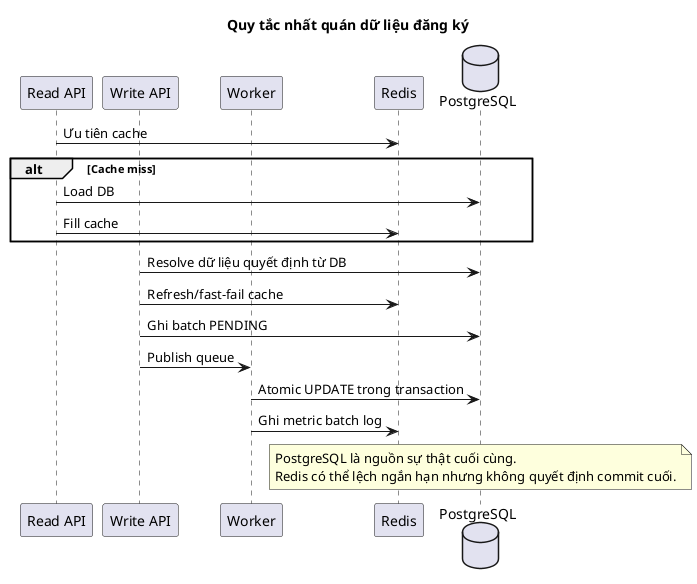
```plantuml
@startuml SD_ConsistencyRules
title Quy tắc nhất quán dữ liệu đăng ký

participant "Read API" as Read
participant "Write API" as Write
participant "Worker" as Worker
participant "Redis" as Redis
database "PostgreSQL" as DB

Read -> Redis : Ưu tiên cache
alt Cache miss
  Read -> DB : Load DB
  Read -> Redis : Fill cache
end

Write -> DB : Resolve dữ liệu quyết định từ DB
Write -> Redis : Refresh/fast-fail cache
Write -> DB : Ghi batch PENDING
Write -> Worker : Publish queue

Worker -> DB : Atomic UPDATE trong transaction
Worker -> Redis : Ghi metric batch log

note over DB
PostgreSQL là nguồn sự thật cuối cùng.
Redis có thể lệch ngắn hạn nhưng không quyết định commit cuối.
end note
@enduml
```
