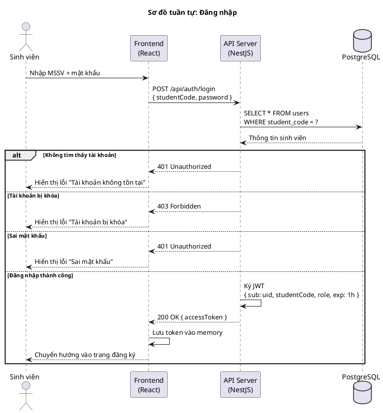
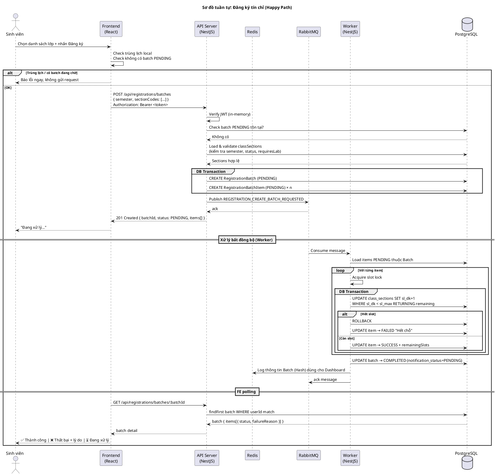
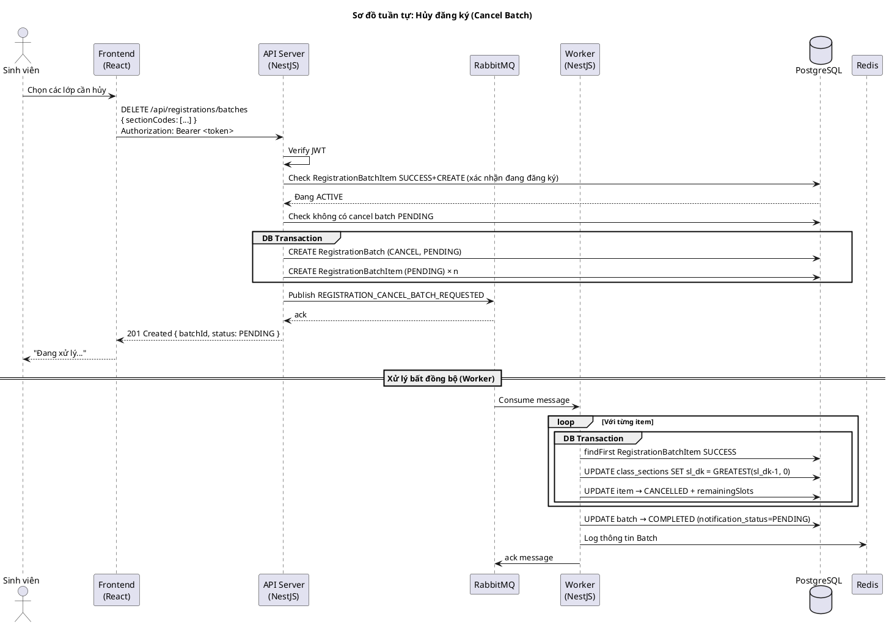
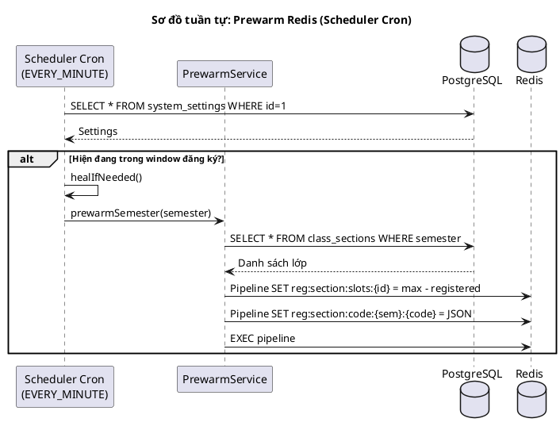
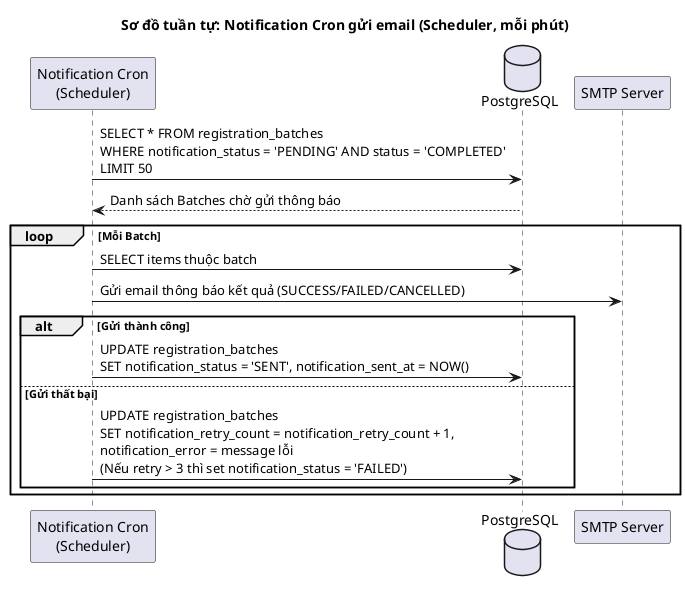

# Sơ đồ tuần tự (Sequence Diagrams)

> Vẽ bằng PlantUML. Paste từng block vào https://www.plantuml.com/plantuml/uml/ để xem.

---

## 1. Đăng nhập (Login)

---

## 2. Đăng ký tín chỉ (Happy Path)

---

## 3. Đăng ký tín chỉ — Batch hủy đăng ký

---

## 4. Prewarm Redis (Scheduler Cron)

---

## 5. Gửi email thông báo (Notification Cron)

