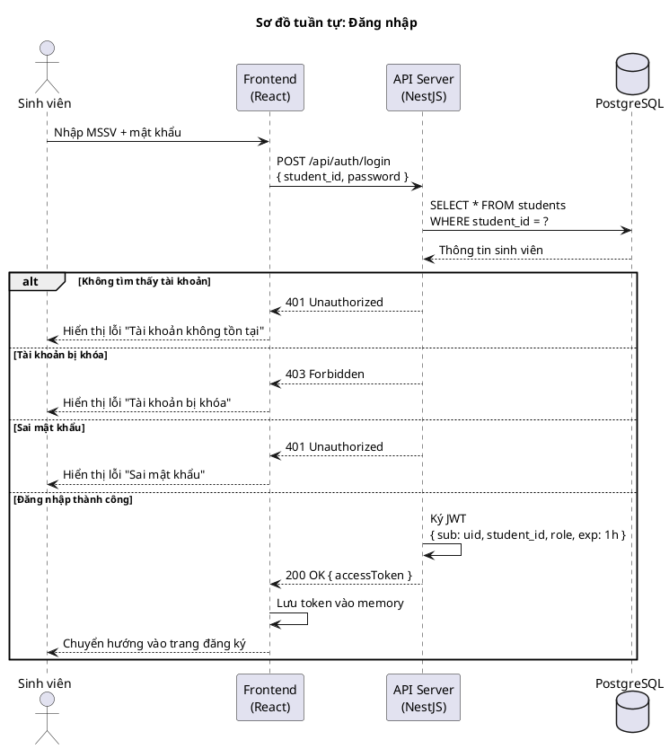
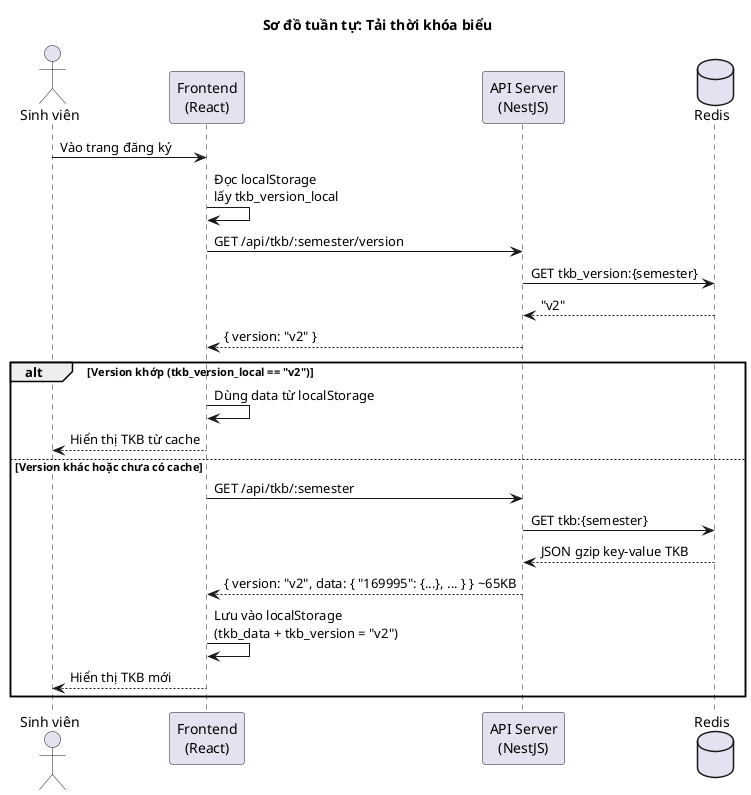
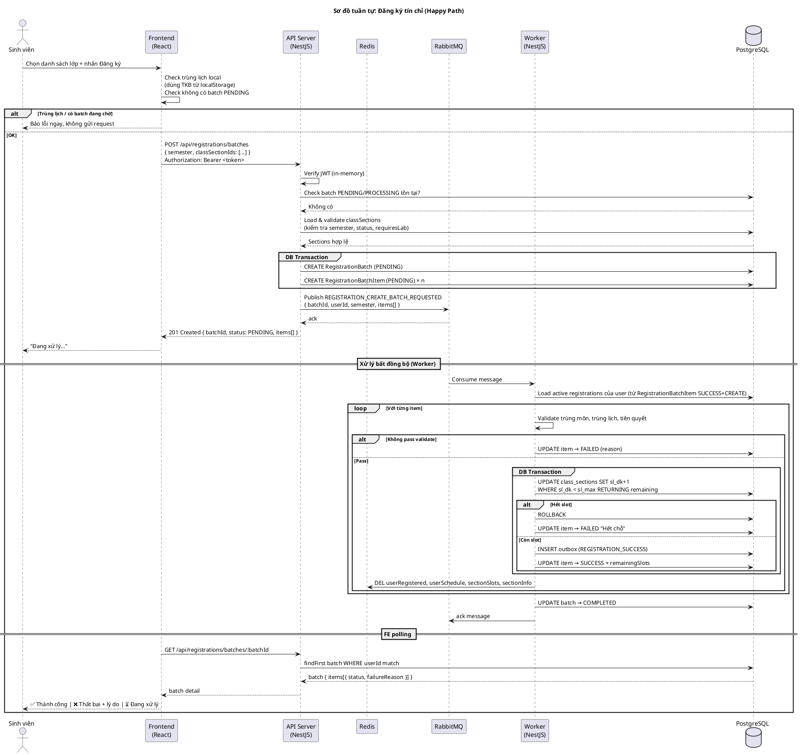
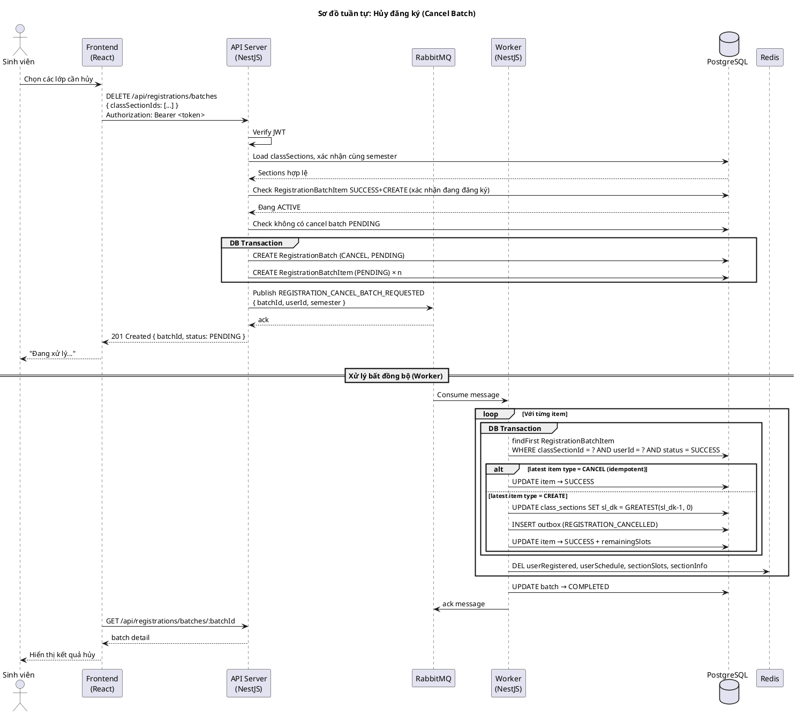
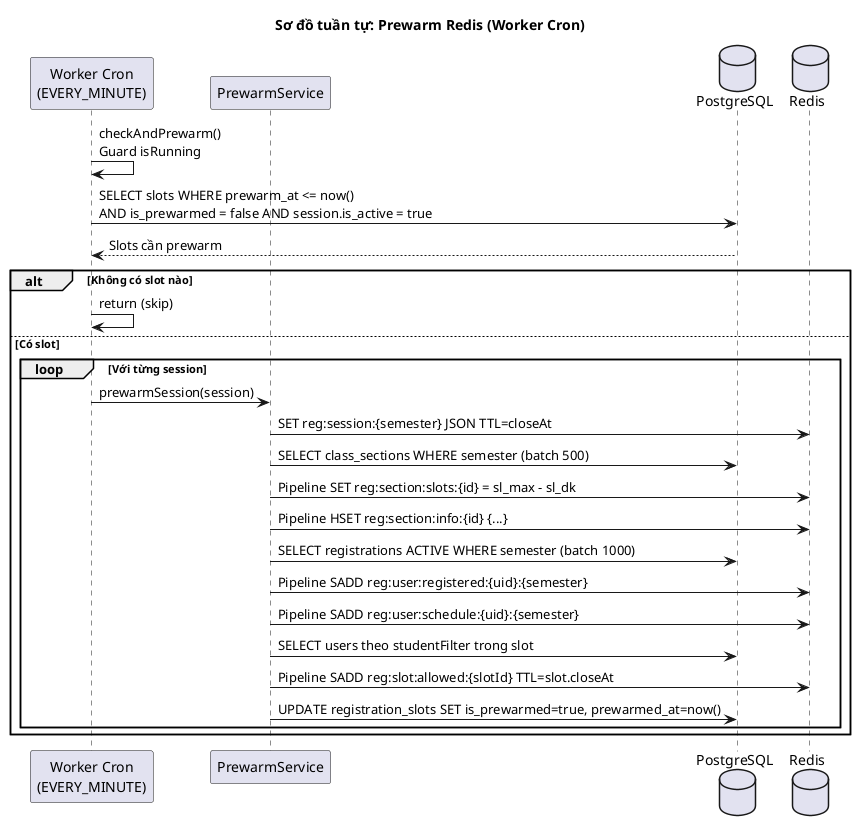
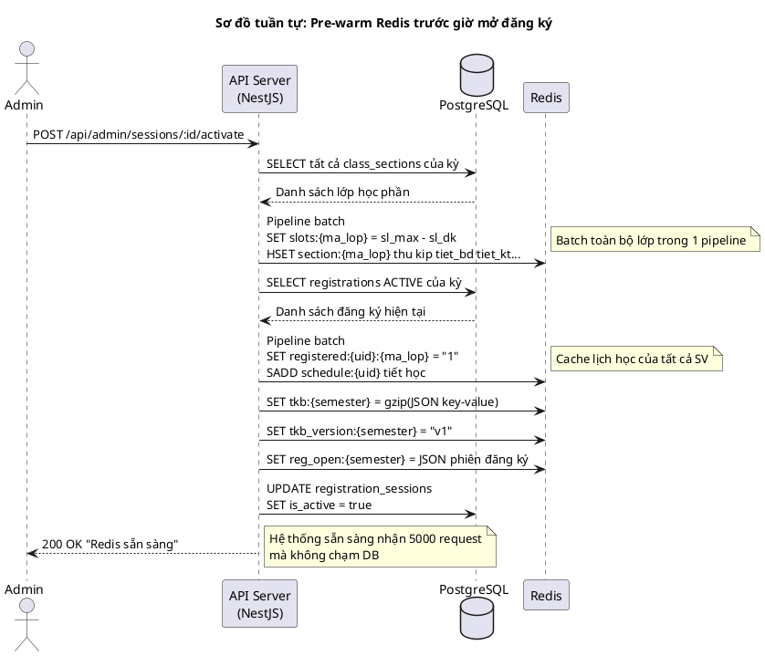
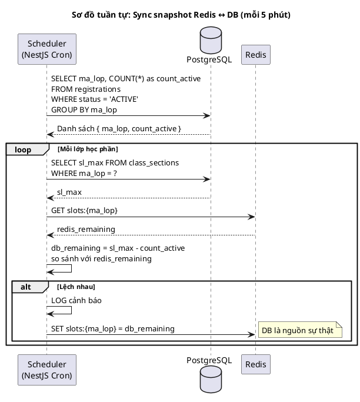
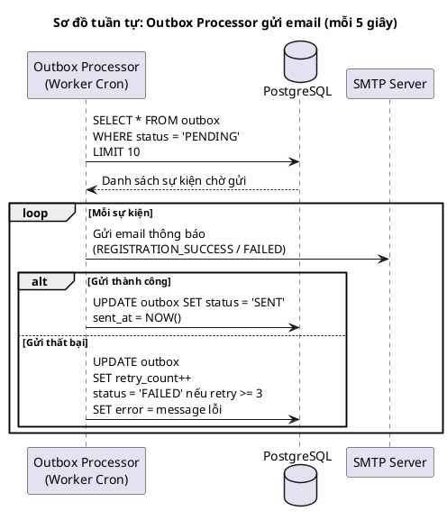

# Sơ đồ tuần tự (Sequence Diagrams)

> Vẽ bằng PlantUML. Paste từng block vào https://www.plantuml.com/plantuml/uml/ để xem.

---

## 1. Đăng nhập (Login)

---

## 2. Tải TKB (Load thời khóa biểu)

---

## 3. Đăng ký tín chỉ (Happy Path)

---

## 4. Đăng ký tín chỉ — Batch hủy đăng ký

---

## 5. Prewarm Redis (Cron Job)

---

## 6. Pre-warm Redis (Admin mở đăng ký)

---

## 7. Sync snapshot Redis ↔ DB (Scheduled Job)

---

## 8. Gửi email thông báo (Outbox Processor)

